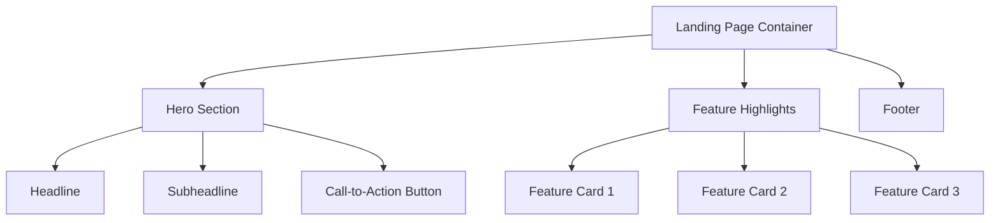
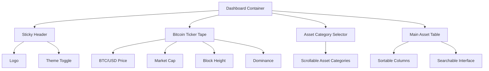
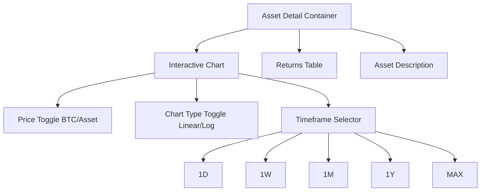

# PricedinBitcoin21.com - Comprehensive Architectural Specification

## Project Structure

### 1. Landing Page (/pages/index.tsx)

#### Design Specifications
- Dark Theme: Black background (#000000)
- Accent Color: Bitcoin Orange (#F7931A)
- Typography: Clean, sans-serif
- Responsive: Mobile-first design

### 2. Tracker Dashboard (/pages/tracker.tsx)

#### Table Columns
- Asset Name
- Asset Type
- Price in BTC
- Returns:
  - YTD
  - 1Y
  - 3Y
  - 5Y
  - MAX

### 3. Asset Detail Page (/pages/asset/[id].tsx)

## Technical Architecture

### API Integration
- Source: TradingEconomics REST API
- Integration Layer: 
  - Centralized API service
  - Caching mechanism
  - Error handling
  - Rate limit management

### State Management
- Global State: Zustand
- Stores:
  - `bitcoinStore`: Real-time BTC data
  - `assetStore`: Global asset information
  - `chartStore`: Visualization state
  - `userPreferencesStore`: Theme, settings

### Performance Optimization
- Server-Side Rendering (SSR)
- Incremental Static Regeneration (ISR)
- Memoized components
- Lazy loading
- WebWorker for complex calculations

### Charting Strategy
- Primary: D3.js for complex interactions
- Fallback: Highcharts
- Rendering Techniques:
  - WebGL for performance
  - SVG for compatibility
  - Responsive design principles

### Responsive Design Breakpoints
- Mobile: <576px
- Tablet: 576px - 992px
- Desktop: 992px - 1200px
- Large Desktop: >1200px

## Technology Stack
- Framework: Next.js 14 (App Router)
- State Management: Zustand
- Styling: Tailwind CSS
- Charting: D3.js
- API Handling: SWR/React Query
- Type Safety: TypeScript

## Security Considerations
- HTTPS
- API key protection
- Input sanitization
- Rate limiting
- CORS configuration

## Deployment Strategy
- Vercel/Netlify
- Continuous Integration
- Automated testing
- Performance monitoring