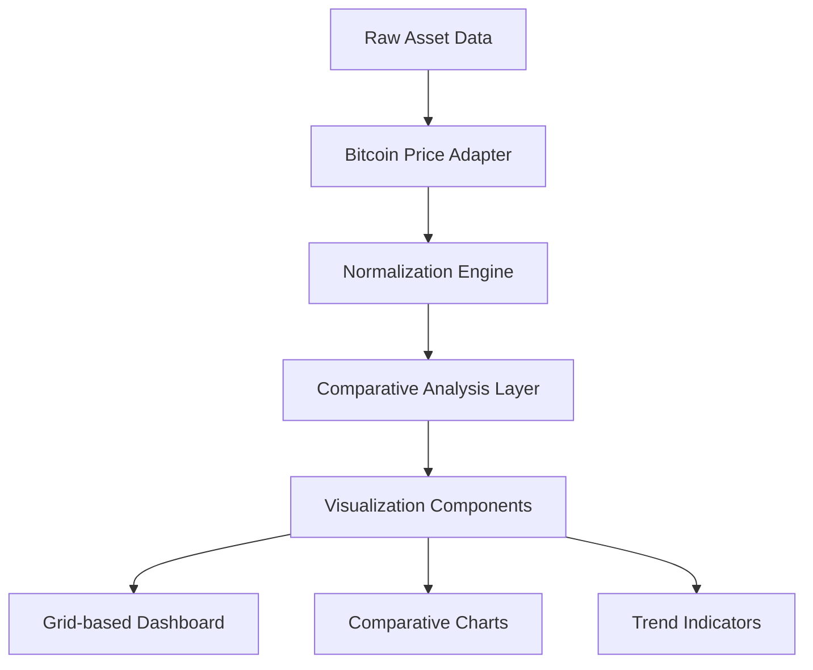

# PricedinBitcoin21.com - Bitcoin-Native Global Asset Tracker

## Updated Architectural Considerations

### Design-Driven Architecture

#### UI/UX Integration Strategies
- Tailwind CSS for responsive, theme-based styling
- Dark mode implementation with dynamic theming
- Performance-optimized rendering for complex visualizations

### Visualization Engine Enhancements
- D3.js with custom Bitcoin-centric rendering
- WebGL for high-performance graphics
- Adaptive charting based on device capabilities

### State Management for Dynamic Comparisons
- Enhanced Zustand stores for:
  - Real-time asset pricing
  - Bitcoin-denominated calculations
  - User interaction state
  - Comparative view configurations

### Data Normalization Refinements

### Responsive Design Breakpoints
- Mobile: Compact, stacked widgets
- Tablet: Adaptive grid layout
- Desktop: Full comparative view
- Ultra-wide: Extended data presentation

### Performance Optimization
- Incremental Static Regeneration
- Client-side data hydration
- Memoized calculation hooks
- Lazy loading of heavy components

### Asset Comparison Strategies
1. Direct Bitcoin Denomination
2. Percentage Change Tracking
3. Historical Performance Curves
4. Volatility Indices

## Technology Stack Evolution
- Next.js 14 (Enhanced App Router)
- React 18 with Concurrent Mode
- Zustand for Reactive State
- D3.js + WebGL Rendering
- Tailwind CSS with Custom Theme
- SWR for Data Fetching
- TypeScript with Strict Typing

## Architectural Principles
- Modularity
- Performance
- Bitcoin-Centric Design
- Adaptive Visualization