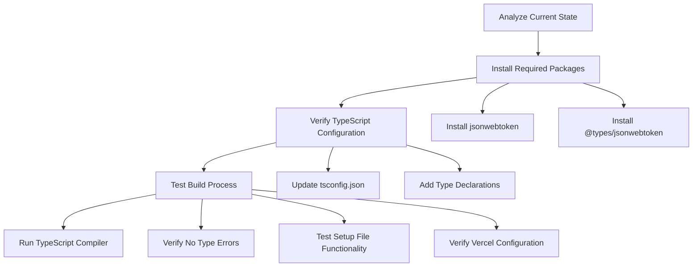

# TypeScript Error Fix Plan

## Problem Analysis

The build is failing on Vercel due to a TypeScript error in `backend/src/tests/setup.ts`:
```
Type error: Could not find a declaration file for module 'jsonwebtoken'
```

Key findings from analysis:
1. The `jsonwebtoken` package is being used in test setup but is missing from dependencies
2. TypeScript type definitions are missing
3. Project has strict TypeScript configuration with `noImplicitAny: true`

## Solution Plan



### 1. Package Installation
- Add `jsonwebtoken` as a regular dependency
  - Required for JWT operations in test authentication
  - Used in production code for token generation/verification
  - Must be in dependencies, not devDependencies, for Vercel builds
- Add `@types/jsonwebtoken` as a dev dependency
  - Provides TypeScript type definitions
  - Only needed during development/build

### 2. TypeScript Configuration
- Update tsconfig.json to include:
  ```json
  {
    "compilerOptions": {
      "strict": true,
      "typeRoots": ["./node_modules/@types", "./typings"],
      "esModuleInterop": true
    }
  }
  ```
- Create fallback type declaration if needed:
  ```typescript
  // typings/jsonwebtoken.d.ts
  declare module 'jsonwebtoken';
  ```
- Ensure consistent module import syntax:
  ```typescript
  import jwt, { JwtPayload } from 'jsonwebtoken';
  ```

### 3. Build Process Testing
- Run TypeScript compiler to verify error resolution
- Check for any new type errors
- Validate test setup functionality
- Test locally before deployment:
  ```bash
  npm run dev
  next build
  ```

### 4. Vercel Configuration
- Verify runtime configuration in vercel.json:
  ```json
  {
    "functions": {
      "api/*.ts": {
        "runtime": "nodejs18.x"
      }
    }
  }
  ```
- Ensure case-sensitive file paths match exactly
- Verify all required dependencies are in production dependencies

## Implementation Steps

1. Update backend/package.json:
```json
{
  "dependencies": {
    "jsonwebtoken": "^9.0.0",
    // ... other dependencies
  },
  "devDependencies": {
    "@types/jsonwebtoken": "^9.0.0",
    // ... other devDependencies
  }
}
```

2. Install new dependencies:
```bash
cd backend
npm install jsonwebtoken
npm install --save-dev @types/jsonwebtoken
```

3. Update TypeScript configuration if needed:
```bash
# Create typings directory if it doesn't exist
mkdir -p typings
```

4. Verify build succeeds:
```bash
npm run build
```

## Expected Outcome
- TypeScript error resolved
- Build process succeeds on Vercel
- Test setup functionality maintained
- Type safety improved through proper type definitions
- Consistent module imports across the project

## Rollback Plan
If issues arise:
1. Remove added packages
2. Restore original package.json and tsconfig.json
3. Consider alternative approaches:
   - Manual type declaration override
   - Module augmentation
   - Disable strict typing for specific modules